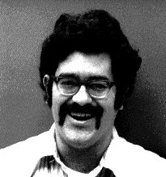
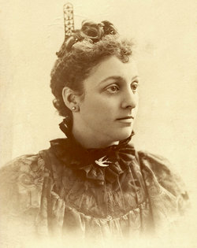

# RALF - the SAIL-WAITS file system

The 'D' program is named **ralf** is in honor of Ralph E. Gorin,
who modestly named the Waits PDP-10 file system verification program, **RALPH**, after himself.
A close reading of the *ralph.fai( source code has enabled writing main_ralf.d
which re-constructs disk images of a file system suitable for
the more authentic 1974 hardware emulators that require files that are shattered into tracks

  Here we build a PDP-10 SU-AI-Lab system disk image for
  the concatenation of a smallish number of 200 Megabyte IBM-3300 disk packs.
  One, two, or three packs is reasonable;
  up to one hundred disk packs is possible to have twenty Gigabytes online
  which is approximately the total offline capacity of the SAILDART tape archive.
  The disk-image () suitable for the 1974 hardware re-enactments;
  but it is not directly usable on actual museum grade hardware without
  a further format conversion (IBM CKD / Merlin and Chickadee).
  
  The disk-image file-set is specified by a database CSV formated table (filename,sn,…) rows
  The actual PDP-10 binary data is copied from (SAILDART digital curator accessible)
  unix file system mounted at pathname /data8/sn/
  where each serial numbered blob is available in DATA8 format, binary 8-bytes per PDP-10 word (zero-left-padded)
  from 000001 to something like 886781;
  or more recently the top serial number is 888474 for authentic blobs
  as more damaged file blobs have become available from the DART archive.

  To verify the highest available blob serial number, sn,
  execute the bash string "(cd /data8/sn;readdir .|sort|tail -1)".
  Blobs beyond sn# 888888 (the Hong-Kong-Lucky serial-number) are not historically authentic,
  but have been fabricated to augment the simulated environment slightly as a stepping stone
  towards handling large quantities of synthetic files (neo-WAITS) for "Look-and-Feel" reënactment.
  
        track = new TRACK[45600];   // 3 packs × 800. cylinders × 19 tracks per cylinder is 458 Megabytes
        track = new TRACK[131072];  // example 17-bit track-address space 2.3 Gigabytes
        track = new TRACK[262144];  // max out 18-bit track-address space 4.6 Gigabytes
  
  NOTE: The System J17 Directory Entry LOC Location Track-Address Space is 30-bits internally,
  since it supports a generous 6-bit low order sector address.
  If a huge DASD for the Re-Enactment is required,
  30-bit or even 36-bit Track addresses could be implemented.
  
  Also we may implement file content indirection, with negative -sn for file-entry LOC location,
  so the initial track space needs to only hold the UFD directory data,
  and blobs are loaded into tracks (or into a track cache) at simulation time.
  ● expect fewer than 2000 programmer codes
  ● expect fewer than 8000 ppn codes
  ● expect fewer than 1 million data blobs, unique sn#
  ● expect fewer than 2 million filename_ppn, would needs 500000 PDP10 words (=217 full tracks)
  ● tolerate 32000 ppn codes in order to handle versions for the 20 year SAILDART epoch (=240 months).
  
# Ralph Gorin

### Synopsis ralf
run$ **ralf** {your\_kit\_path}

- creates a disk-image file named kit\_path/DASD.data8
- from the SAILDART archive /data8/sn/*
- selecting the names as listed in kit\_path/ralf.csv

### Description ralf
This sub-directory contains a 'D' language program *(an outlier language in my œuvre)*
which can do the heavy lifting of building large *(and even small)* DASD.data8 files
that comprise all the tracks *(the block level structure)*
of a **SAIL-WAITS IBM-3330** shared file system, excluding the UDP pack(s).

The list of file names is specified by a database table file, **ralf.csv**,
which refers to the 54G file system at mount point **/data8/sn**.
Each row in **ralf.csv** has eight fields:

PRG, PRJ, FILNAM, EXT, wc, tbx, sn, date time

Each /data8/sn/xxxxxx serial numbered SAILDART archive blob contains the content of one SAIL file
with one thirty-six bit PDP-10 word per eight bytes, little endian.

### Source ralf.d
- main_ralf.d
- track.d
- word.d

## makefile rakf targets are
- make
- make go
- make tracks
- make clean
- make purge

# Maud Arques Frasse 

### Synopsis maud

run$ maud { your kit path }

### Description maud

After SAILDART human digital curators make improvements to the UCFS files and UCFS directories;
we run maud to update the DASD format version of the model SAIL-WAITS file system.

Maud re-builds the kitpath DASD file from the kitpath UCFS tree of files in the following steps
- Remove the model MFD ./UCFS/1.1 directory
- Make empty MFD ./UCFS/1.1
- Walk the UCFS re-packing fresh TEST back into stale DATA8 files.
- Allocate track space to all the DATA8 files and write a track zero SAT table.
- Rebuild the model MFD directory with new PRGPRJ.UFD sub directory files.
- Place DATA8 file content into DASD track positions.

Next the DASD may be *used* directly by some PDP-10 simulation software (for example the dorunrun)
or it can be further converted to IBM CKD formated disk packs by

**DASD\_into\_chickadee** { kit\_path }

The CKD packs (for example pack named 0.ckd ) may be *used* by other PDP-10
emulation software (for example SIMKA).
Emulation made changes to the CKD pack content
can be converted onward to the Linux UCFS model by running

**chickadee\_into\_UCFS** { kit\_path }

And back again by maud.

### Trivia re maud

Central to Silicon Valley, the intersection of Maud and Matilda in Sunnyvale California
is named for two women born in the 19th century, who were members of the extensive Murphy family
which once owned, settled and farmed the land that became Sunnyvale.

